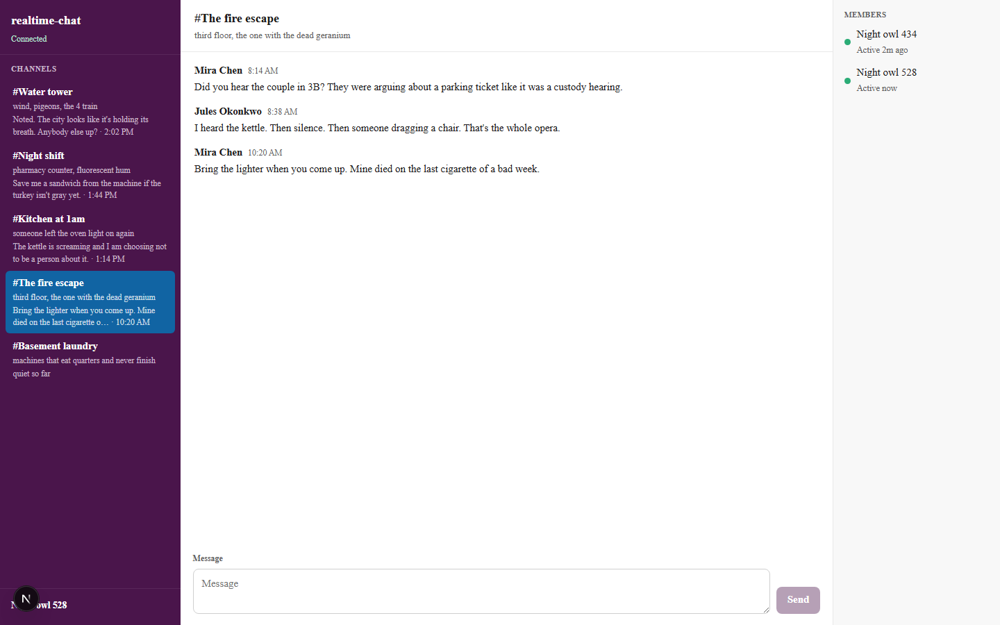

# realtime-chat

A Slack-style workspace for live talk: channel list, thread, composer, and presence. History is seeded so rooms already have messages when you join.



## Run it

Needs Node 20+ (tested on 24).

```bash
npm install
npm run dev
```

That starts two processes:

- web UI at [http://localhost:3000](http://localhost:3000)
- WebSocket wire at `ws://127.0.0.1:3001`

You should see an aubergine sidebar of channels (fire escape, kitchen at 1am, night shift, water tower, basement laundry), a white thread in the middle (Mira, Jules, Tess, Anil, the super), and a **Members** rail on the right once you join. Type in **Message** and hit Send — another browser tab on the same workspace should get it live. **Basement laundry** has no history; that is the empty-channel state.

If port 3000 or 3001 is taken, stop the other process or override:

```bash
# PowerShell
$env:WS_PORT="3021"
$env:NEXT_PUBLIC_WS_PORT="3021"
npx next dev --port 3020
npx tsx server/index.ts
```

If the composer says **Connecting…**, the socket is down — the banner **Retry** reconnects. Status in the sidebar reads **Connecting…**, **Connected**, or **Offline**.

## Layout

- `src/domain` — rooms, messages, presence, clocks
- `src/data` — seed history, in-memory store, protocol, `useWire`
- `src/ui` — workspace shell, thread, composer
- `server/index.ts` — WebSocket server

No accounts. Your handle is stored in `localStorage` as `Night owl NNN` until you click it and rename.

## License

MIT.
