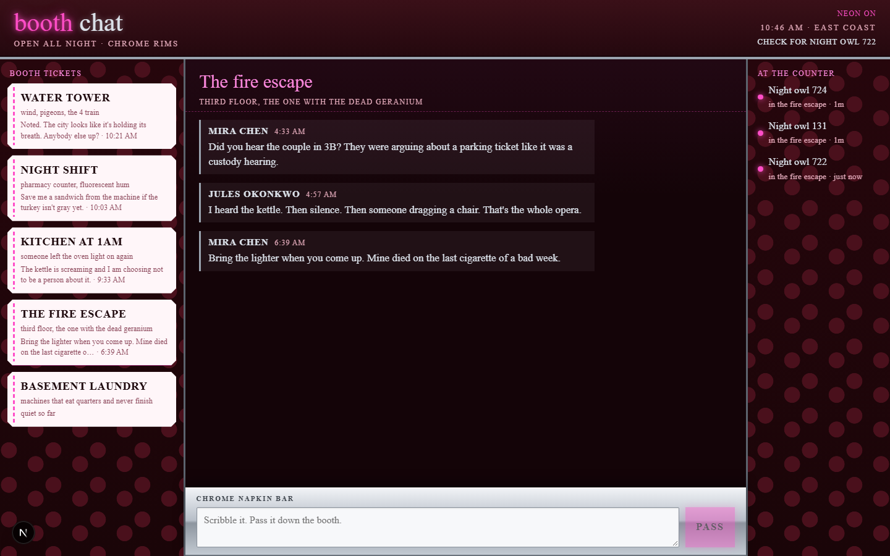

# realtime-chat

A vinyl diner booth for late talk. Pick a ticket (fire escape, kitchen at 1am, night shift, water tower, basement laundry), see who is at the counter, and pass a napkin. History is seeded so the joint already has gossip when you slide in.



## Run it

Needs Node 20+ (tested on 24).

```bash
npm install
npm run dev
```

That starts two processes:

- web UI at [http://localhost:3000](http://localhost:3000)
- WebSocket wire at `ws://127.0.0.1:3001`

You should see a deep burgundy booth: ticket stubs on the left with last lines and times, a thread in the middle (Mira, Jules, Tess, Anil, the super), and an **at the counter** rail on the right once you join. Type on the **chrome napkin bar** and hit pass — another browser tab on the same booth should get it live. **Basement laundry** has no history; that is the blank-napkin empty state.

If port 3000 or 3001 is taken, stop the other process or override:

```bash
# PowerShell
$env:WS_PORT="3021"
$env:NEXT_PUBLIC_WS_PORT="3021"
npx next dev --port 3020
npx tsx server/index.ts
```

If the composer says the bar is locked, the socket is down — the banner **kick the jukebox** retries.

## Layout

- `src/domain` — rooms, messages, presence, clocks
- `src/data` — seed history, in-memory store, protocol, `useWire`
- `src/ui` — booth chrome, thread, napkin bar
- `server/index.ts` — WebSocket server

No accounts. Your handle is stored in `localStorage` as `Night owl NNN` until you click the check and rename.

## License

MIT.
