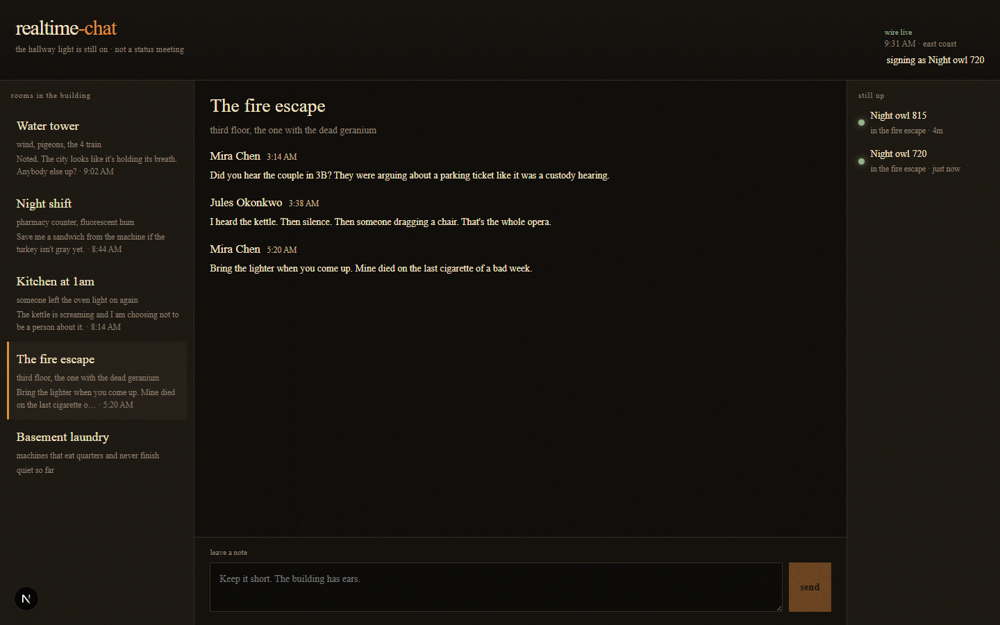

# realtime-chat

Late-night rooms in a walk-up. Open a floor (fire escape, kitchen at 1am, night shift, water tower, basement laundry), see who is still awake, and leave a note. History is seeded so the building already has gossip when you arrive.



## Run it

Needs Node 20+ (tested on 24).

```bash
npm install
npm run dev
```

That starts two processes:

- web UI at [http://localhost:3000](http://localhost:3000)
- WebSocket “night wire” at `ws://127.0.0.1:3001`

You should see a dark desk: room list on the left with last lines and times, a thread in the middle (Mira, Jules, Tess, Anil, the super), and a **still up** rail on the right once you join. Type in **leave a note** and hit send — another browser tab on the same room should get it live. **Basement laundry** has no history; that is the quiet-room empty state.

If port 3000 or 3001 is taken, stop the other process or override:

```bash
# PowerShell
$env:WS_PORT="3021"
$env:NEXT_PUBLIC_WS_PORT="3021"
npx next dev --port 3020
npx tsx server/index.ts
```

If the composer says it is locked, the socket is down — the banner **plug the lamp back in** retries.

## Layout

- `src/domain` — rooms, messages, presence, clocks
- `src/data` — seed history, in-memory store, protocol, `useWire`
- `src/ui` — desk chrome, thread, composer
- `server/index.ts` — WebSocket server

No accounts. Your handle is stored in `localStorage` as `Night owl NNN` until you click it and rename.

## License

MIT.
